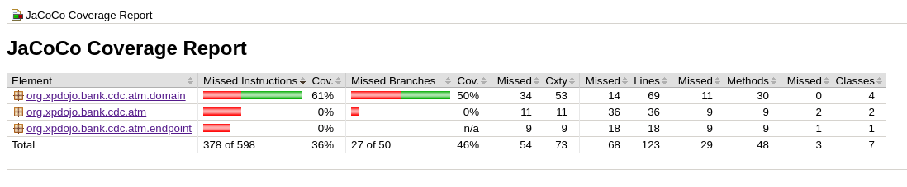
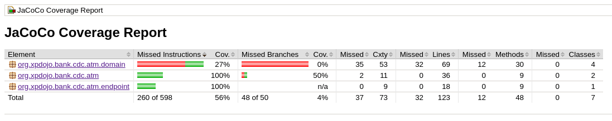
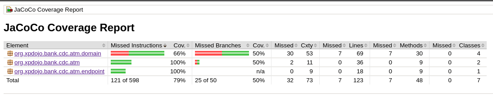

# Measuring the coverage of Manual Testing

## Why ?
I was recently asked by a senior leader how he could test the effectiveness of the manual testing.  While he was being told that the test coverage was adequate the actual coverage from the manual testing was subjectively assessed.  He wanted something a little more scientific.  The ask was: "how can we measure the coverage of manual tests in a UAT environment".

## The Dangers of this approach
Before we get into the hows and wherefores, we need to list a few caveats of the this approach and how to make sense of it:

1. Code coverage only measures the amount of code executed.  It does not mean that the code has been tested (ie assessed for correctness).
1. It should really be used to tell you which code has not been executed, not that the code that was tested with the right rigour of specificity.
1. Really the focus for code coverage should be at unit test level as this is more likely to have the fine grained assertions that are needed for deep testing
1. Its a pretty graph at the end of the day with links back into the code and should be used for rough assessment and for the triggering of new test case formation
1. Test coverage is not a measure of team success, code quality or safety in the code.  This can only come from trusting your engineering teams.
1. Whatever you do, please don't run this in production ... no good can come from this.

## So how do you measure the code

Notes:
 
* I am assuming the build of a JVM language and the use of Gradle in this post (I simply can't face talking about Maven anymore ... XML is dead, long live Groovy)
* Also I am using one of the Sprint Boot services we use for coding katas found [here](https://github.com/xp-dojo/consumer-driven-contracts) if you would like to reproduce what I have done

### Automated build
Firstly, you should bake into your build process the measuring of automated unit tests.  If nothing else, the very fact that you are looking at test coverage and asking questions will start engineering teams thinking about unit tests.  One would expect this to lead to some level of coaching or training.  We would also love to find teams that will vigourously push back on unit test coverage from well meaning managers who are looking for a statistic to measure teams on.  The super simple way of adding in a code coverage measurement into your build is with the addition of the following into your `build.gradle` file:

```groovy
apply plugin: 'jacoco'
```

This will bake into your build the JaCoCo (Java Code Coverage) measures.

By running `gradle clean build jacocoTestReport` this will generate an html code coverage report in html in the `build` directory.  Additionally in the `build/jacoco` directory you should find a file called `test.exec` that contrains the binary coverage data.  This is important as this will be used later to merge with the manual test binary coverage data.

This will give you automated coverage information looking like



### Collecting coverage data from a manual testing environment
To create the execution data in a standalone enviroment such as UAT you need to do a little bit of trickery to instrument the code.  We use the [JaCoCo Agent](https://repo1.maven.org/maven2/org/jacoco/org.jacoco.agent) to weave instrumentation into the code through the classloader (ie at runtime) to allow us to measure it.  You will need to download the runtime.jar.  Next time you start your test environment add the following to your java command line:

``` bash
java -javaagent:/*location of jacoco runtime jar*/org.jacoco.agent-0.8.5-runtime.jar=destfile=manual.exec,includes=package.prefix.* -jar yourApplication.jar
```
... which in my case was ...
```bash
java -javaagent:/home/suggitpe/jacoco-safe/org.jacoco.agent-0.8.5-runtime.jar=destfile=manual.exec,includes=org.xpdojo.* -jar atm-service-0.0.1.jar 
```

This configures the JaCoCo library to write to a destination file called manual.exec and only include data relating to classes wiith a package prefix of `org.xpdojo`.  The default configuration is to append to the file.  The default behaviour is to dump to file as the jvm shuts down so dont expect it to populate during normal operation.  More about the Agent can be found [here](https://www.eclemma.org/jacoco/trunk/doc/agent.html) including how to serve the data to a remote agent rather than a local file.

Worth noting if you are testing a Spring Boot app that I have listed the boot jar at the end of the command line.  Ctrl+C to terminate the process worked fine for me.

This will give you manual coverage information looking like



### Generating a merged coverage file
To generate the merged report we are going to use the [JaCoCo Comand Line Interface](https://repo1.maven.org/maven2/org/jacoco/org.jacoco.cli/) which will need to be downloaded somewhere loacally for you to use it (I have used the nodeps version for simplicity).  Assuming all the exec files are in the same directory as the CLI jar you can run the following to create your merged coverage report:

```bash
java -jar org.jacoco.cli-0.8.5-nodeps.jar report manual.exec test.exec --classfiles /*location of classes executed*/out/production/classes/ --sourcefiles /*location of source code*/src/main/java --html html-report
```
... which in my case was ... 
```bash
java -jar org.jacoco.cli-0.8.5-nodeps.jar report test.exec manual.exec --classfiles /home/suggitpe/git-clones/xp-dojo/consumer-driven-contracts/atm-service/build/classes/java/main --sourcefiles /home/suggitpe/git-clones/xp-dojo/consumer-driven-contracts/atm-service/src/main/java --html html-report
```

Note: the only thing you need to be super careful of is that the classes used for test execution must be exactly the same as the ones used in the report else you will get a "does not match" error when generating the report.  Its worth testing each *.exec file individually before you run the merged one.

This will give you blended information looking like

